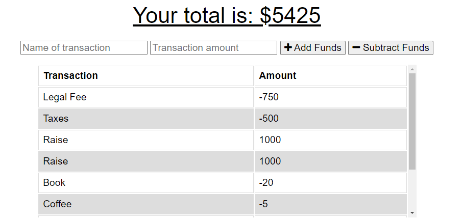
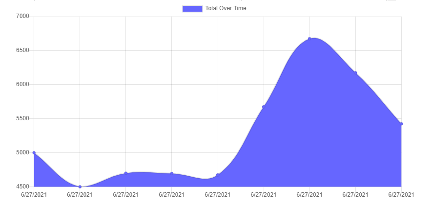
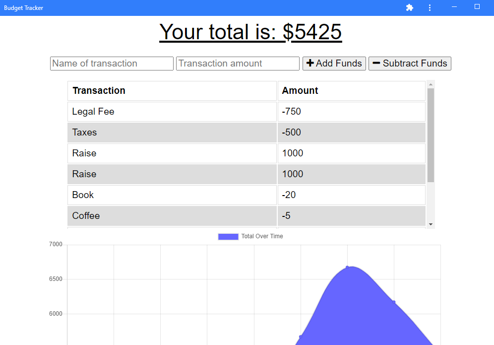

# Budget Tracker


## Table of Contents
- [Project Overview](#project-overview) 
- [Live Application](#live-application)
- [Installation](#installation)
- [License](#license)
- [Screenshots](#screenshots)

## Project Overview
Full stack application for tracking expenses over time. Every instance of income or expense is logged by the user, and the data is then represented on the chart for easy visualization of total income over time. The application is built using HTML, CSS, and JavaScript for the client side. On the backend, the application uses Express for the server, Mongoose for the ODM, and MongoDB for the database.

In addition, this is a progressive web application that the user can download to their desktop to use locally. The application is also able to function offline through the use of IndexedDB as a temporary database until network connection is reestablished to post the pending data to the Mongo database.

[View the live application](https://budget.stephentechblog.com/) in Heroku.

### Languages Used
- JavaScript
- MongoDB
- HTML
- CSS

### Node Libraries Used
- [Mongoose](https://www.npmjs.com/package/mongoose)
- [Express](https://www.npmjs.com/package/express)
- [Compression](https://www.npmjs.com/package/compression)

See [package.json](./package.json) for full list of dependencies.

### Additional Libraries
- [Chart.js](https://www.chartjs.org)
- [Font Awesome](https://fontawesome.com)

## Live Application
[View application deployment](https://budget.stephentechblog.com) in Heroku.

## Installation
To run this application on your local machine, Node.js is _required_. Once cloned/downloaded from GitHub, enter ```npm i``` in command line to install the packages referenced under Libraries Used automatically. 

Then, create the Mongo database by running the command ```use budgetdb``` in your MongoDB CLI. You are now be ready to launch the application by entering ```npm start```.

## License
Permission is hereby granted, free of charge, to any person obtaining a copy of this Software and associated documentation files (the "Software"), to deal in the Software without  restriction, including without limitation the rights to use, copy, modify, merge, publish distribute, sublicense, and/or sell copies of the Software, and to permit persons to whom the Software is furnished to do so, subject to the following conditions.

[View the full license](./LICENSE)

## Screenshots





